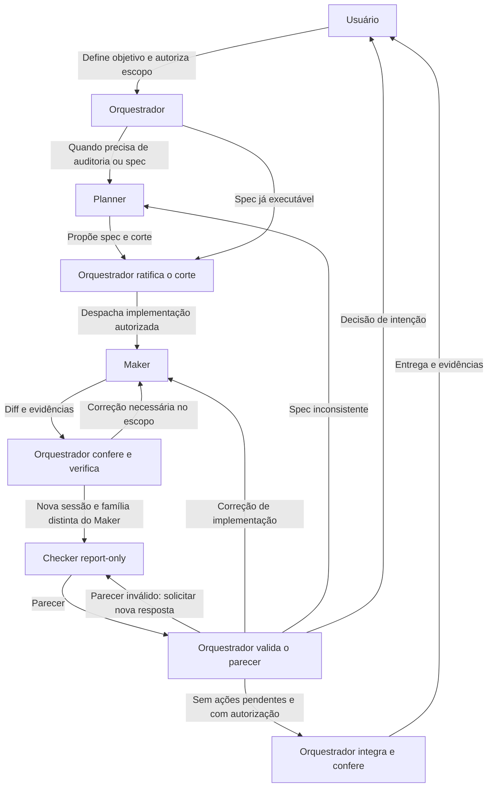

# tl-orchestrator

Um método documental para planejar, implementar e revisar mudanças com Orquestrador, Planner, Maker e Checker. Usa agentes e portões já disponíveis no projeto consumidor. A distribuição contém documentos Markdown, schema JSON e licença; não precisa de linguagem de programação, runtime próprio ou instalação do projeto de origem.

Criado por **Albertiano**. Distribuído sob a [licença MIT](LICENSE), que permite uso, modificação e distribuição, inclusive comercial, com preservação do aviso de copyright e da licença nas cópias ou partes substanciais do material.

Comece por [SKILL.md](SKILL.md). A [configuração do projeto](docs/PROJECT_CONFIGURATION.md) explica como descobrir regras e portões sem impor estrutura ao consumidor. BMAD, quando utilizado, permanece oficial e instalado separadamente.

## Como os papéis trabalham

O fluxo abaixo descreve uma mudança com implementação autorizada. Um pedido limitado a análise
ou planejamento termina nessa etapa. Decisões reservadas ao usuário voltam a ele.



## Exportar os onze arquivos

Em um terminal com ferramentas padrão POSIX, entre na raiz do pacote (pasta deste README). O bloco abaixo cria uma pasta temporária nova fora do projeto e nomeia exatamente os onze arquivos distribuídos. Usa `/tmp` para que uma configuração local de `TMPDIR` não leve a exportação para dentro do projeto. A pasta de origem deve estar fora de `/tmp` ou deve-se conferir que o destino não está dentro dela.

```sh
set -eu
export_dir=$(mktemp -d /tmp/tl-orchestrator.XXXXXX)
mkdir "$export_dir/prompts" "$export_dir/schemas" "$export_dir/docs"
cp README.md SKILL.md LICENSE "$export_dir/"
cp prompts/orchestrator.md \
   prompts/orchestrator-perfis.md \
   prompts/orchestrator-playbook.md \
   prompts/planner.md \
   prompts/maker.md \
   prompts/checker-report-only.md "$export_dir/prompts/"
cp schemas/review-result.schema.json "$export_dir/schemas/"
cp docs/PROJECT_CONFIGURATION.md "$export_dir/docs/"
printf '%s\n' "$export_dir"
(cd "$export_dir" && find . -type f -print | LC_ALL=C sort)
```

Copiam-se apenas os caminhos explícitos, todos arquivos regulares. Outros arquivos da origem, inclusive `.gitignore`, histórico, configurações locais e backlog, não entram. Não use cópia recursiva da origem para exportar. A exportação não publica nem instala nada.

Para conferir os onze arquivos, execute a partir da mesma raiz:

```sh
checksum_file=$(mktemp /tmp/tl-orchestrator-sha256.XXXXXX) &&
shasum -a 256 README.md SKILL.md LICENSE \
  prompts/orchestrator.md prompts/orchestrator-perfis.md \
  prompts/orchestrator-playbook.md prompts/planner.md \
  prompts/maker.md prompts/checker-report-only.md \
  schemas/review-result.schema.json docs/PROJECT_CONFIGURATION.md \
  > "$checksum_file" &&
(cd "${export_dir:?Execute primeiro o bloco de exportação}" && shasum -a 256 -c "$checksum_file")
```

O manifesto fica fora do pacote exportado. O encadeamento com `&&` só inicia a conferência se
todos os hashes de origem forem gerados com sucesso; arquivo ausente, cópia alterada ou erro de
leitura retorna falha. `sha256sum` pode substituir `shasum -a 256` se for a ferramenta disponível.
A comparação executada é evidência pontual, não certificação automática do método.

## Instalar e ativar

Escolha uma pasta de skills suportada pelo seu agente conforme a documentação disponível no ambiente. Crie nela um diretório **novo** chamado `tl-orchestrator` e copie todo o pacote exportado, mantendo os subdiretórios. Não sobreponha uma instalação existente sem antes comparar seu conteúdo.

Exemplo genérico, depois de definir `skills_parent` com a pasta escolhida:

```sh
install_dir="$skills_parent/tl-orchestrator"
mkdir "$install_dir"
cp -R "$export_dir/." "$install_dir/"
```

A raiz instalada contém os contratos; a raiz do projeto consumidor contém a tarefa, as regras e os portões. Informe ao agente o projeto e o resultado desejado. Exemplo: “Use esta skill para **somente planejar** a mudança descrita na story do projeto atual; não implemente nem despache agentes.”

Os limites, a divisão de papéis e a autoridade do usuário estão no [contrato do Orquestrador](prompts/orchestrator.md). O método não fornece lock atômico, journal, certificado automático, validação automática de schema, notificações ou continuidade fora da sessão.
